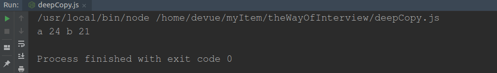
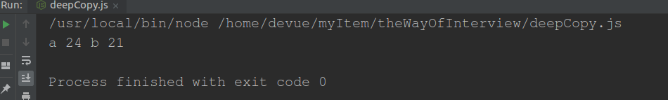
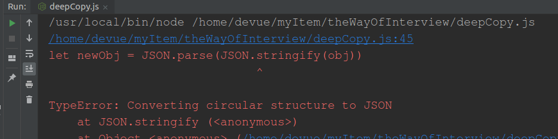
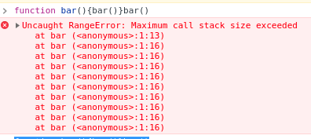

# 前端面试之道
## 闭包
>经典面试题，循环中使用闭包解决 `var` 定义函数的问题
```js
for (var i = 1; i <= 5; i++) {
  setTimeout(function timer() {
    console.log(i)
  }, i * 1000)
}
```
首先因为 setTimeout 是个异步函数，所以会先把循环全部执行完毕，这时候 i 就是 6 了，所以会输出一堆 6。


- 方案一:let
```js
for (let i = 0; i <= 10; i++) {
    setTimeout(function () {
        console.log(i)
    }, i * 1000)
}
```


- 方案二: 闭包
```js
for (var i = 0; i <= 10; i++) {
    (function (j) {
        setTimeout(function () {
            console.log(j)
        }, j * 1000)
    })(i)
}
```

详情请看[闭包应用之延迟函数setTimeout](https://www.cnblogs.com/camille666/p/js_setTimeout.html)
让我理解了立即执行函数的意义

- 方案三:setTimeout传参
```js
for (var i = 0; i <= 10; i++) {
    setTimeout(function (j) {
        console.log(j)
    }, i * 1000, i)
}

```


>涉及面试题：什么是浅拷贝？如何实现浅拷贝？什么是深拷贝？如何实现深拷贝？

:::tip
在上一章节中，我们了解了对象类型在赋值的过程中其实是复制了地址，从而会导致改变了一方其他也都被改变的情况。通常在开发中我们不希望出现这样的问题，我们可以使用浅拷贝来解决这个情况。
:::
```js
let a = {
  age: 1
}
let b = a
a.age = 2
console.log(b.age) // 2
```
## 浅拷贝
首先可以通过 Object.assign 来解决这个问题，很多人认为这个函数是用来深拷贝的。其实并不是，Object.assign 只会拷贝所有的属性值到新的对象中，如果属性值是对象的话，拷贝的是地址，所以并不是深拷贝。

> Object.assign
```js
// Object.assign()
let a = {age: 21}
let b = Object.assign({}, a)
a.age = 24
console.log('a', a.age, 'b', b.age)
```


> ...展开运算符
```js
let a = {age: 21}
let b = {...a}
a.age = 25
console.log('a', a.age, 'b', b.age)
```


> 浅拷贝只能解决第一层的问题
```js
let a = {
    author: {
        age: 21
    }
}
let b = {...a}
a.author.age = 24
console.log('a', a.author.age, 'b', b.author.age)
```
## 深拷贝
> 深拷贝解决上一个问题
```js
let a = {
    author: {
        age: 21
    }
}
let b = JSON.parse(JSON.stringify(a))
a.author.age = 24
console.log('a', a.author.age, 'b', b.author.age)
```

[JSON.parse()和JSON.stringify()用法解析](https://blog.csdn.net/weixin_40475396/article/details/79723413)让你明白JSON.parse和stringify用法

>但是该方法也是有局限性的：
会忽略 undefined
会忽略 symbol
不能序列化函数
不能解决循环引用的对象
```js

let obj = {
  a: 1,
  b: {
    c: 2,
    d: 3,
  },
}
obj.c = obj.b
obj.e = obj.a
obj.b.c = obj.c
obj.b.d = obj.b
obj.b.e = obj.b.c
let newObj = JSON.parse(JSON.stringify(obj))
console.log(newObj)
```
如果你有这么一个循环引用对象，你会发现并不能通过该方法实现深拷贝

在遇到函数、 undefined 或者 symbol 的时候，该对象也不能正常的序列化
```js
let a = {
    age: undefined,
    sex: Symbol('male'),
    jobs: function() {},
    name: 'yck'
}
let b = JSON.parse(JSON.stringify(a))
console.log(b) // {name: "yck"}
```
你会发现在上述情况中，该方法会忽略掉函数和 undefined 。

但是在通常情况下，复杂数据都是可以序列化的，所以这个函数可以解决大部分问题。

如果你所需拷贝的对象含有内置类型并且不包含函数，可以使用 [MessageChannel](https://developer.mozilla.org/zh-CN/docs/Web/API/MessageChannel)
[HTML5 postMessage 和 onmessage API 详细应用](https://www.ibm.com/developerworks/cn/web/1301_jiangjj_html5message/index.html)
```js
function structuralclone(obj) {
    return new Promise(resolve => {
        const {p1, p2} = new MessageChannel()
        p2.onmessage = ev => resolve(ev.data)
        p1.postMessage(obj)
    })
}

var obj = {
    a: 1,
    b: {
        c: 2
    }
}

obj.b.d = obj.b

const test = async () => {
    const clone = await structuralclone(obj)
    console.log(clone)
}
test()
```


当然你可能想自己来实现一个深拷贝，但是其实实现一个深拷贝是很困难的，需要我们考虑好多种边界情况，比如原型链如何处理、DOM 如何处理等等，所以这里我们实现的深拷贝只是简易版，并且我其实更推荐使用 [lodash 的深拷贝函数](https://lodash.com/docs/4.17.11#cloneDeep)。

```js
function deepClone(obj) {
    function isObject(o) {
        return (typeof o === 'object' || typeof o === 'function') && o !== null
    }

    if (!isObject(obj)) {
        throw new Error('非对象')
    }

    let isArray = Array.isArray(obj)
    let newObj = isArray ? [...obj] : { ...obj }
    Reflect.ownKeys(newObj).forEach(key => {
        newObj[key] = isObject(obj[key]) ? deepClone(obj[key]) : obj[key]
    })

    return newObj
}

let obj = {
    a: [1, 2, 3],
    b: {
        c: 2,
        d: 3
    }
}
let newObj = deepClone(obj)
newObj.b.c = 1
console.log(obj.b.c) // 2

```
## 原型
>涉及面试题：如何理解原型？如何理解原型链？

- Object 是所有对象的爸爸，所有对象都可以通过 __proto__ 找到它
- Function 是所有函数的爸爸，所有函数都可以通过 __proto__ 找到它
- 函数的 prototype 是一个对象
- 对象的 __proto__ 属性指向原型， __proto__ 将对象和原型连接起来组成了原型链
[深度解析原型中的各个难点](https://github.com/KieSun/Dream/issues/2)
::: tip
老师的原型讲解一遍没看懂，之后看。
我记得另一个老师讲的原型是：对象的_proto_指向构造函数的prototype,构造函数的prototype指向原型，组成了原型链。
:::
## ES6 知识点及常考面试题
想必大家也知道 var 存在的问题了，使用 var 声明的变量会被提升到作用域的顶部
### 原型继承和Class继承
>涉及面试题:原型如何实现继承,Class如何实现继承?Class本质是什么?
#### 组合继承
```js
function Perent(val) {
    this.val = val;
}

Perent.prototype.getValue = function () {
    console.log(this.val)
}

function Child(val) {
    Perent.call(this, val)
}

Child.prototype = new Perent()
const child = new Child(1)
child.getValue()
child instanceof Perent

```

#### 寄生组合继承
```js
function Perent(val) {
    this.val = val
}

Perent.prototype.getValue = function () {
    console.log(this.val)
}

function Child(val) {
    Perent.call(this, val)
}

Child.prototype = Object.create(Perent.prototype, {
    constructor: {
        value: Child,
        enumerable: false,
        writable: true,
        configurable: true
    }
})
const child = new Child(1)
child.getValue()
child instanceof Perent
```

#### class 实现继承
```js

class Parent {
    constructor(val) {
        this.val = val
    }

    getVal() {
        console.log(this.val)
    }
}

class Child extends Parent {
    constructor(val) {
        super(val)
        this.val = val
    }
}

let child = new Child(12)
child.getVal()
child instanceof Parent
```

### 模块化
> 涉及面试题:为什么要使用模块化?都有哪几种方式可以模块化,各有什么特点?
####立即执行函数
```js
(function (globalVariable) {
    globalVariable.test = function () {

    }
})(globalVariable)

```
不明白立即执行函数的意义

#### AMD和CMD
 ```js
define(['./a', './b'], function (a, b) {
    a.do()
    b.do()
})

define(function (require, exports, module) {
    var a = require('./a')
    a.do()
})

```   
    
#### CommonJS
```js

module.exports={
    a:1
}
exports.a=1
var module=require('./a.js')
module.a

var module=require('./a.js')
module.a
module.exports={a:1}
var module={
    id:'xxxx',
    exports:{}
}
var exports=module.exports
var load=function (module) {
    var a=1
    module.exports=a
    return module.exports
}
```

#### ES Module
```js
import xxx from './a.js'
import {xxx} from './a.js'

export function a() {
}

export default function () {
}
```

### Proxy
> 涉及面试题:Proxy可以实现什么功能?
```js

let onWatch = (obj, setBind, getLogger) => {
    let handler = {
        get(target, property, receiver) {
            getLogger(target, property)
            return Reflect.get(target, property, receiver)
        },
        set(target, property, value, receiver) {
            setBind(value, property)
            return Reflect.set(target, property, value)
        }
    }
    return new Proxy(obj, handler)
}
let obj = {a: 10}
let p = onWatch(
    obj,
    (v, property) => {
        console.log(`监听到属性${property}改变为${v}`)
    },
    (target, property) => {
        console.log(`'${property}'=${target[property]}`)
    }
)
p.a=101
p.a

```

### map-filer-reduce
> 涉及面试题:map-filter-reduce各自有什么作用?
#### map
```js
console.log([123, 1232, 123123].map(v => v + 2))
//[ 125, 1234, 123125 ]

console.log(['1', '2', '3'].map(parseInt))
//[ 1, NaN, NaN ]
```

#### filter
```js
let array=[12,45,4,12,48,1,5]
console.log(array.filter(v=>v>20))
```
#### reduce
```js
array = [12, 1454, 1, 45, 2]
console.log(array.reduce((acc, current) => acc + current))
// 1514
```
```js
let array = [1, 5, 55, 114, 8]
// console.log(array.map(v => v * 2))
// [ 2, 10, 110, 228, 16 ]
console.log(array.reduce((acc, current) => {
    acc.push(current * 2)
    return acc
}), [])
```
## JS异步编程及常考面试题
### 并发(concurrency)和并行(parallelism)区别
> 涉及面试题:并行与并发的区别

### 回调函数(Callback)
> 涉及面试题:什么是回调函数?回调函数有什么缺点?如何解决回调地域问题

### Generator
>涉及面試題:你理解的generator是什么?
```js {1}
function* foo(x) {
    let y = 2 * (yield (x + 1))
    let z = yield (y / 3)
    return (x + y + z)
}

let it = foo(5)
//x=5
console.log(it.next())//{ value: 6, done: false }
//x=5 y=48
console.log(it.next(24))//{ value: 16, done: false }
//x=5 y=48 z=25
console.log(it.next(25))//{ value: 78, done: true }

```
generator函数解决回调地域


### Promise
> 涉及面试题:promise的特点是什么,分别有什么优缺点?什么是Promise链?Promise
构造函数执行和then函数执行有什么却别?

```js
new Promise((resolve, reject) => {
    console.log('new promise')
    resolve('resolve')
})
console.log('finish')
```
```js
Promise.resolve(1).then(res => {
    console.log(res)
    return 2
}).then(res => {
    console.log(res)
})
// 1
// 2
```

### async和await
> 涉及面试题:async和await的特点,他们的优点和缺点分别是什么?await原理是什么?

```js
async function test() {
    return '2'
}

console.log(test())//Promise { '2' }
```
```js
let a = 0
let b = async () => {
    a = a + await 10
    console.log('2', a)
}
b()
a++
console.log('1', a)
```
### 常用定时器函数
> 涉及面试题:setTimeout/setInterval/requestAnimationFrame各有什么特点?
```js
let period = 60 * 1000 * 60 * 2
let startTime = new Date().getTime()
let count = 0
let end = new Date().getTime() + period
let interval = 1000
let currentInterval = interval

function loop() {
    count++
    // 代码执行所消耗的时间
    let offset = new Date().getTime() - (startTime + count * interval);
    let diff = end - new Date().getTime()
    let h = Math.floor(diff / (60 * 1000 * 60))
    let hdiff = diff % (60 * 1000 * 60)
    let m = Math.floor(hdiff / (60 * 1000))
    let mdiff = hdiff % (60 * 1000)
    let s = mdiff / (1000)
    let sCeil = Math.ceil(s)
    let sFloor = Math.floor(s)
    // 得到下一次循环所消耗的时间
    currentInterval = interval - offset
    console.log('时：'+h, '分：'+m, '毫秒：'+s, '秒向上取整：'+sCeil, '代码执行时间：'+offset, '下次循环间隔'+currentInterval)

    setTimeout(loop, currentInterval)
}

setTimeout(loop, currentInterval)

```
::: tip
不懂先过一下
:::

## 手写 Promise
```js
// 实现简易版的promise
const PENDING = 'pending'
const RESOLVED = 'resolved'
const REJECTED = 'rejected'

function MyPromise(fn) {
    const that = this
    that.state = PENDING
    that.value = null
    this.resolvedCallbacks = []
    this.rejectedCallbacks = []

    function resolve(value) {
        if (that.state === PENDING) {
            that.state = RESOLVED
            that.value = value
            that.resolvedCallbacks.map(cb => cb(that.value))
        }
    }

    function reject(value) {
        if (that.state === PENDING) {
            that.state = REJECTED
            that.value = value
            that.rejectedCallbacks.map(cb => cb(that.value))
        }
    }

    try {
        fn(resolve, reject)
    } catch (e) {
        reject(e)
    }
}

//1.
// - pending/resolved/rejected表示状态
// - 创建that用于获取正确的this对象
// - promise开始状态为pedding
// - value用来保存resolve和reject传入的值
// - this.resolvedCallbacks 和this.rejectedCallbacks保存then回调的值,等待状态改变时使用
//2.
// - 只有等待态才能改变状态
// - 将当前状态改为对应状态,value赋值
// - 遍历回调数组并执行

MyPromise.prototype.then = function (onFulfilled, onRejected) {
    const that = this
    console.log('onRejected', onRejected)
    console.log('onFulfilled', onFulfilled)
    onFulfilled = typeof onFulfilled === 'function' ? onFulfilled : v => v
    onRejected = typeof onRejected === 'function' ? onRejected : r => {
        throw r
    }
    if (that.state === PENDING) {
        that.resolvedCallbacks.push(onFulfilled)
        that.rejectedCallbacks.push(onRejected)
    }
    if (that.state === RESOLVED) {
        onFulfilled(that.value)
    }
    if (that.state === REJECTED) {
        onRejected(that.value)
    }
}
//
// - 判断参数是否是函数类型
// - 当参数不是函数类型时,需要创建一个函数赋值给对应的参数,同时也实现了透传
// - 判断状态的逻辑,当状态不是等待态时,就去执行相对应的函数.如果是等待态的话,就往回调函数中push函数.
new MyPromise((resolve, reject) => {
    setTimeout(() => {
        resolve(111)
    }, 5000)
    console.log('2121')
}).then(value => {
    console.log('value', value)
})

```

## Event Loop
###  进程与线程
> 涉及面试题:进程与线程区别?JS单线程带来的好处?

- 进程是一段程序,描述了CPU在运行指令及加载和保存上下文所需的时间
线程是更小单位,描述了一段指令所需的时间

- JS引擎线程和渲染线程是互斥的,如果没有单线程,则会出错.

### 执行栈
> 涉及面试题:什么是执行栈?
```js
function bar(){bar()}bar()
```


### 浏览器中的Event Loop
> 涉及面试题:异步代码执行顺序?解释一下什么是Event Loop?

- 将异步代码挂起,再需要执行的时候加入Task队列中.一旦执行栈为空,就从队列中拿代码.本质来说异步还是同步行为(这句话没看懂)
```js
console.log('start')

async function async1() {
    await async2()
    console.log('async1')
}

async function async2() {
    console.log('async2')
}

async1()
setTimeout(function f() {
    console.log('setTimeout')
}, 100)

new Promise(resolve => {
    console.log('promise')
    resolve()
}).then(function () {
    console.log('promise1')
}).then(function () {
    console.log('promise2')
})

console.log('end')
// start
// async2
// promise
// end
// promise1
// promise2
// async1
// setTimeout
```
::: tip
promise中的resolve()之后才能进入then()
:::
1. 首先执行同步代码,这属于宏任务
2. 执行完所有同步代码后,执行栈为空,则查询是否有异步代码需要执行
3. 执行所有微任务
4. 执行完所有微任务后,如有必要会渲染页面
5. 开始下一轮的event Loop,执行宏任务中的异步代码,也就是setTimeout中的回调函数

(宏任务-微任务)
(看了两遍,还是不太懂)

### Node中的Event Loop
> 涉及面试题:Node中的Event Loop和浏览器中的有什么区别?process.nextTick执行顺序?

- 完全不同

## JS 进阶知识点及常考面试题
### 手写call/apply和bind函数
> 涉及面试题:call/apply和bind函数内部实现是怎么样的?
```js
Function.prototype.maCall = function (context) {
    if (typeof this !== 'function') {
        throw new TypeError('error')
    }
    context = context || window
    context.fn = this
    const args = [...arguments].slice(1)
    const result = context.fn(...args)
    delete context.fn
    return result
}


function Product(name, price) {
    this.name = name,
        this.price = price
}

function Food(name, price) {
    Product.maCall(this, name, price)
    this.category = 'food'
}

console.log(new Food('DDDD', 2342))

```

```js
Function.prototype.myApply = function (context) {
    if (typeof this !== 'function') {
        throw new TypeError('ERROR')
    }
    context = context || window
    context.fn = this
    let result
    if (arguments[1]) {
        result = context.fn(...arguments[1])
    } else {
        result = context.fn()
    }
    delete context.fn
    return result
}

const num = [5, 454, 4, 51, 48674, 14, 2]
const max = Math.max.myApply(this, num)
console.log(max)

```

### new
>涉及面试题:new的原理是什么?通过new的方式创建对象和通过字面量创建有什么区别?

可以见[js-new](https://github.com/qiufeihong2018/JS/blob/master/js/js.js)

### instanceof原理
>涉及面试题:instanceof原理是什么?
```js
function myInstanceof(left, right) {
    left = left.__proto__
    let prototype = right.prototype
    while (true) {
        if (left === null || left === undefined)
            return false
        if (prototype === left)
            return true
        left = left.__proto__
    }
}

function Car(make, model, year) {
    this.make = make;
    this.model = model;
    this.year = year;
}

var auto = new Car('Honda', 'Accord', 1998);

console.log(myInstanceof(auto, Car));
// expected output: true

console.log(myInstanceof(auto, Object));
// expected output: true

```
::: tip
__proto__中的__是两个"_"
:::

### 为什么0.1+0.2!=0.3
> 涉及面试题:为什么0.1+0.2!=0.3?如何解决这个问题?
精度丢失
```js
console.log(0.1 + 0.2 === 0.30000000000000004)//true
console.log(0.1 + 0.2 === 0.3)//false
console.log(0.100000000000000002)//0.1
console.log(parseFloat((0.1+0.2).toFixed(10))===0.3)

```
[parseFloat](https://developer.mozilla.org/zh-CN/docs/Web/JavaScript/Reference/Global_Objects/Number/toFixed)

### 垃圾回收机制
> 涉及面试题:V8下的垃圾回收机制是怎么样的?
(小册子讲的不清楚)

### 新生代算法

### 老生代算法

## JS 思考题
> 思考题1:JS分为哪两大类型?都有什么各自的特点?你该如何判断正确的类型?
1. 原始类型(null和number)
2. 对象类型(垃圾回收,深浅拷贝)
3. 判断类型(typeof和instaceof)

> 思考题二:你理解的原型是什么?

prototype-原型链-原型继承-class继承

> 思考题三:bind/call和apply各自有什么区别?

this,new

> 思考题四:es6中有使用过什么? 

class-原型链;promise-异步;proxy-vue;let-var

> 思考题五:JS是如何运行的?

单线程-线程和进程区别-执行栈-EventLoop-微任务和宏任务-浏览器和node中的EventLoop-垃圾回收机制

## DevTools Tips
之后慢慢看

## 浏览器基础知识点及常考面试题
### 事件机制
> 涉及面试题:事件的触发过程是怎么样的?知道什么是事件代理吗?
 
- window往事件触发处传播,遇到注册的捕获事件会触发
- 传播到事件触发处时触发注册的事件
- 从事件触发处往window传播,遇到注册的冒泡事件会触发
---
- 去的路上
- 终点
- 回的路上
1. 注册事件
2. 事件代理
应该注册在父节点上

### 跨域
>涉及面试题:什么是跨域?为什么浏览器要适用同源策略?你有集中方式可以解决跨域问题?了解预检请求吗?

1. 同源策略(协议/域名/端口)
2. 主要防止CSRF攻击

方式:
- JSONP
- CORS(服务端设置Accesss-Control-Allow-Origin)
- document.domain(二级域名相同)
- postMessage


### 存储
> 涉及面试题:有几种方式可以存储功能,分别有什么优缺点?什么是service worker?
- cookie
- localstorage
- sessionstorage
- indexDB

service worker: 浏览器背后的独立线程

## Webpack 性能优化
### 减少Webpack打包时间
#### 优化Loader
```js
loader: 'babel-loader?cacheDirectory=true'
```
#### HappyPack
HappyPack可以将Loader的同步执行转换为并行
#### DLLPlugin
可以将特定的类库提前打包然后引入

### 代码压缩
- resolve.extensions
- resolve.alias
- module.noParse

### 减少Webpack打包后的文件体积
>注意:该内容也属于性能优化领域
####按需加载
我们可以适用按需加载,将每个路由页面单独打包为一个文件
#### Scope Hoisting
会分析出模块之间的依赖关系,尽可能把打包出来的模块合并到一个函数中去.
#### Tree Shaking
可以实现删除项目中未被引用的代码
