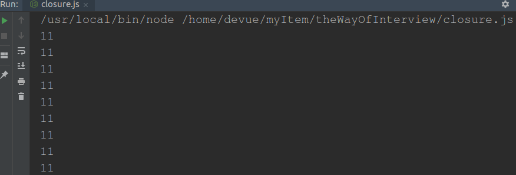
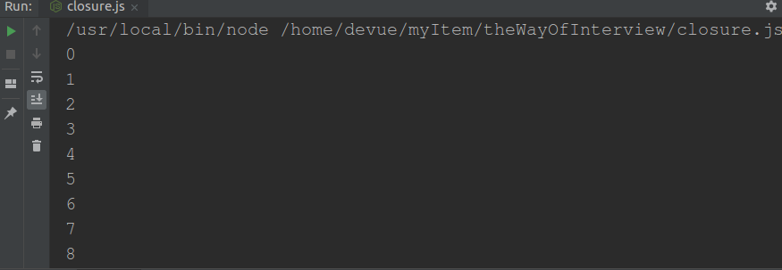

# 前端面试之道
## 闭包
>经典面试题，循环中使用闭包解决 `var` 定义函数的问题

首先因为 setTimeout 是个异步函数，所以会先把循环全部执行完毕，这时候 i 就是 6 了，所以会输出一堆 6。

- 方案一:let

- 方案二: 闭包

详情请看[闭包应用之延迟函数setTimeout](https://www.cnblogs.com/camille666/p/js_setTimeout.html)
让我理解了立即执行函数的意义

- 方案三:setTimeout传参

